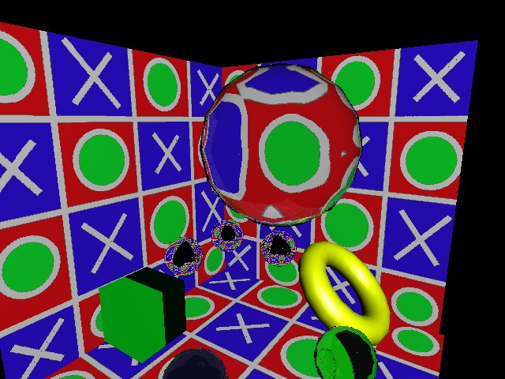

# Ray Tracing with the Single-Slab Hierarchy

Bounding volume hierarchies have become a very popular way to speed up ray tracing. In this paper we present a novel traversal and approximation scheme for bounding volume hierarchies, which is comparable in speed, has a very compact traversal algorithm and uses only 25% of the memory, compared to a standard bounding volume hierarchy.



How to run on UNIX:
```sh
# interactive mode
./simdtrace -mode=I -methods=S -light=1 models/kugeln.obj

# test mode
./simdtrace -mode=T -frames=1 -methods=S -ignoreMaterials -shadows=0 models/kugeln.obj
```

How to run on Windows:
```sh
# interactive mode
RayTracer.exe -mode=I -methods=S -light=1 models/kugeln.obj

# test mode
RayTracer.exe -mode=T -frames=1 -methods=S -ignoreMaterials -shadows=0 models/kugeln.obj
```

Additional information
---

[Download Paper (PDF)](https://woizischke.com/ray-tracing-single-slab-hierarchy.pdf)

Official website: [TU-Braunschweig](https://graphics.tu-bs.de/publications/Eisemann08SSH)

Author: [Christian Woizischke](https://woizischke.com)
